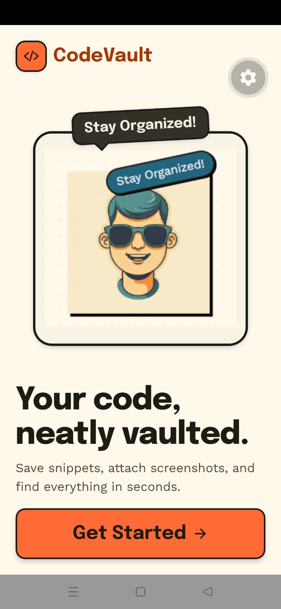
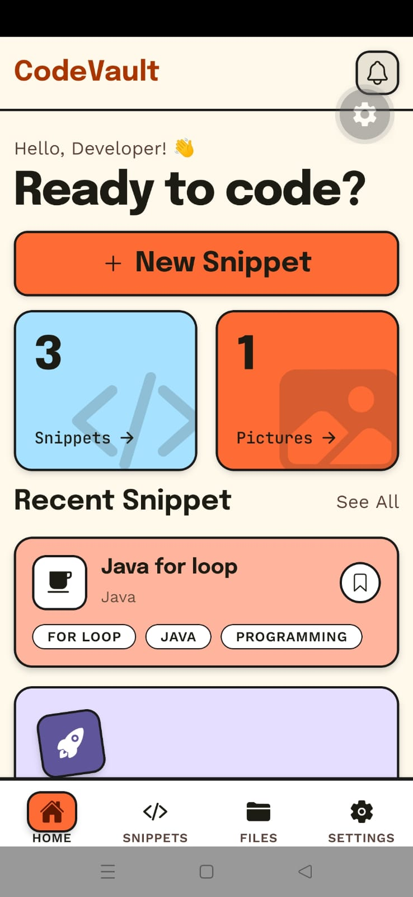
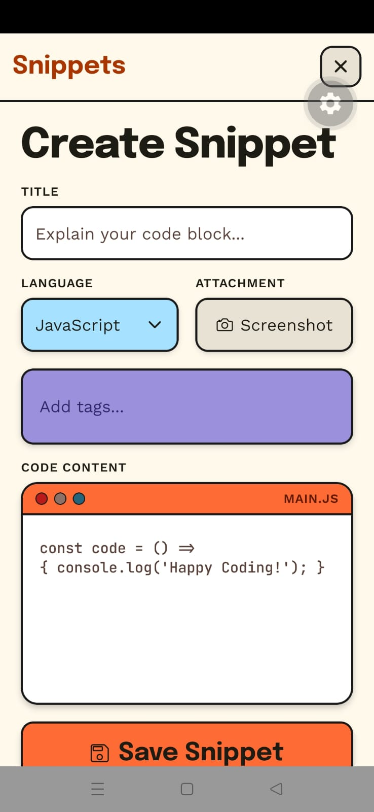
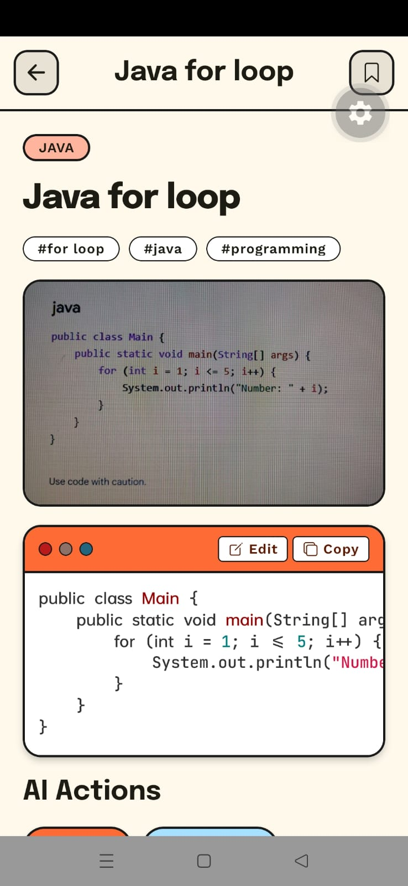
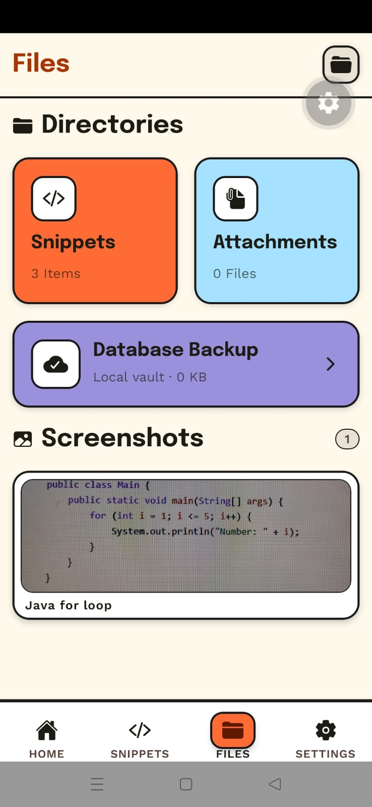
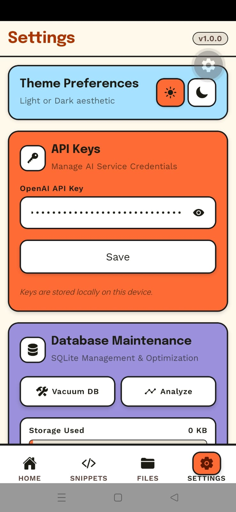
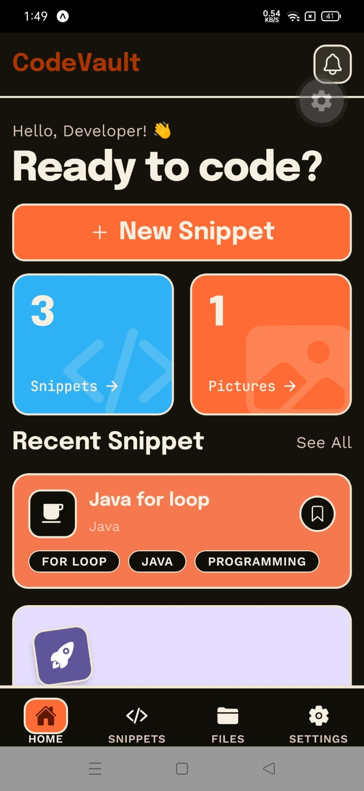

# CodeVault

CodeVault is a mobile code-snippet manager built with Expo and React Native. It lets you save snippets, organize tags, attach screenshots, switch themes, and use AI actions to explain, summarize, or improve saved code.

## Screens

| Onboarding | Home | Create Snippet |
| :---: | :---: | :---: |
|  |  |  |

| Snippet Details | Files | Settings |
| :---: | :---: | :---: |
|  |  |  |

| Dark Mode |
| :---: |
|  |

## Features

- Save code snippets with title, language, tags, and optional screenshots.
- Browse recent snippets from the home screen.
- View snippet details with syntax highlighting.
- Run AI actions for explain, summarize, and improve using your OpenAI API key.
- Store API keys locally with Expo SecureStore.
- Track attached files and screenshots from the Files tab.
- Switch between light and dark themes.
- Maintain the local SQLite database with vacuum and analyze actions.

## Tech Stack

- Expo SDK 56
- React Native 0.85
- Expo Router
- Expo SQLite
- Expo SecureStore
- Expo Image Picker and Expo Image
- TypeScript

## Getting Started

Install dependencies:

```bash
npm install
```

Start the development server:

```bash
npx expo start
```

Then scan the QR code with Expo Go, or press `a` / `i` in the terminal to open Android or iOS.

## Project Structure

```text
src/
+-- app/          # Expo Router screens and tabs
+-- components/   # Reusable UI components
+-- constants/    # Theme tokens
+-- context/      # Theme provider
+-- db/           # SQLite migration setup
+-- services/     # AI service helpers

assets/images/    # App icons and README screenshots
```
